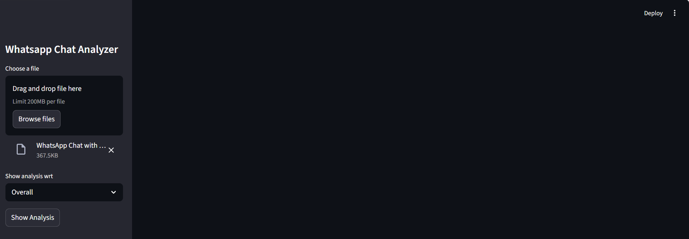
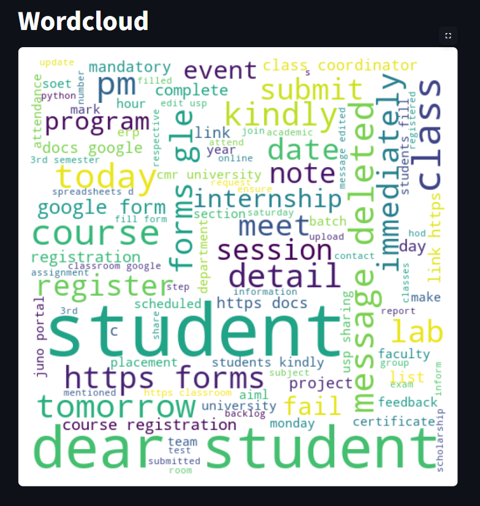
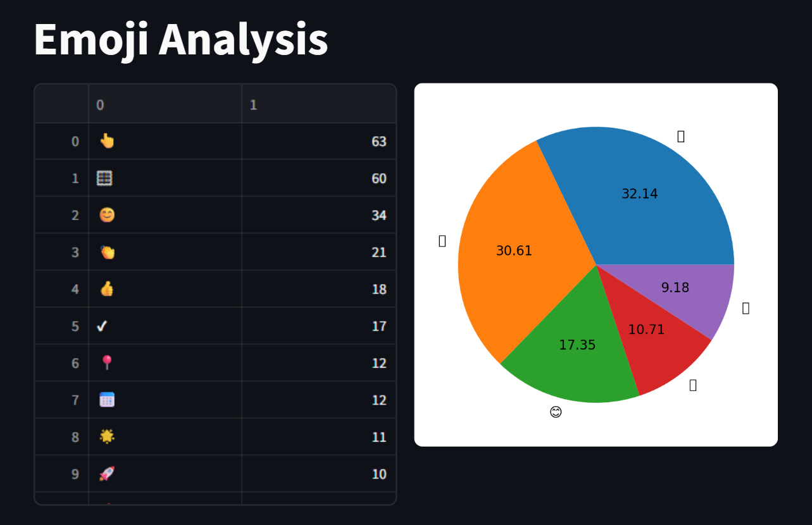
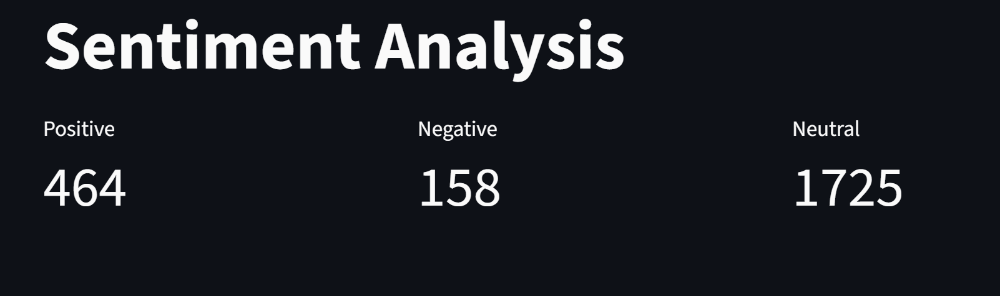

# 📊 WhatsApp Chat Analyzer

WhatsApp Chat Analyzer is a Python-based data analysis and visualization application that helps users extract meaningful insights from exported WhatsApp chat files (.txt format).

The application processes raw chat data and converts it into structured information using regex-based preprocessing. It then generates clear statistics, interactive visualizations, and analytical insights to help understand communication patterns.

Users can explore features such as message statistics, user activity trends, word cloud visualization, emoji analysis, and sentiment analysis to better understand conversation behavior.

This project demonstrates the use of data analysis, visualization, and basic NLP techniques to transform unstructured chat data into useful and interpretable insights.

## 🚀 Key Features

### 📊 Chat Statistics
- Total messages, words, media files, and links shared  

### 👥 User Activity Analysis
- Identifies the most active participants
- Shows messaging patterns over time  

### ☁️ Word Cloud Generation
- Visual representation of frequently used words  

### 📁 Media Analysis
- Counts images, videos, audio, and documents  

### 😂 Emoji Analysis
- Highlights commonly used emojis  

### 📅 Message Timeline
- Displays daily and monthly activity trends  

### 😊 Sentiment Analysis
- Classifies messages as positive, negative, or neutral  
        
### 🎨 Interactive Streamlit Dashboard
- Simple and user-friendly interface for exploring insights 

## 🛠️ Technologies Used

- 🐍 Python  
- 🌐 Streamlit  
- 📊 Pandas  
- 🔢 NumPy  
- 📉 Matplotlib & Seaborn  
- ☁️ WordCloud  
- 😊 TextBlob (Sentiment Analysis)

## 📸 Screenshots

### 🏠 Home Page

### 📊 Chat Statistics

### 📈 Timeline Analysis

### ☁️ Word Cloud

### 😂 Emoji Analysis

### 😊 Sentiment Analysis

**📂 How to Use:**

1.Export a WhatsApp chat as a .txt file (without media)

2.Open the live demo or run the app locally

3.Upload the chat file

4.Explore insights and visualizations

5.Export reports if needed

## 🎯 Use Cases

-  Personal and group chat analysis
    
-  Studying communication patterns and trends
   
-  Academic mini-project or final-year project
   
-  Practice for data analysis and visualization
  
-  Identifying most active users in conversations
    
-  Understanding conversation tone using sentiment analysis
   
-  Analyzing chat activity over time
   
-  Exploring frequently used words and emojis

## 📌 Project Status

- ✅ Fully functional  
- 🌐 Deployed using Streamlit  
- 🔄 Open for future enhancements

- ## 👩‍💻 Author
- 
Deasanur Ankitha  
Python Developer | Data Analysis | Machine Learning Enthusiast

⭐ If you found this project useful, consider giving it a star on GitHub!.
        
